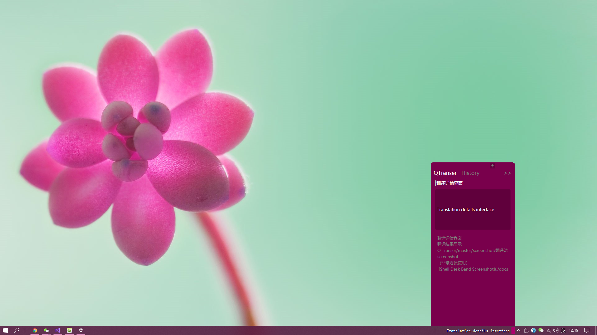

# QTranser
一款简单的翻译软件（非常方便使用）

## 厉害的Ctrl+C 
您只需要按下Ctrl+C将文字复制进剪切板：

这是一款从Mac中叫[“快译”](https://itunes.apple.com/cn/app/%E5%BF%AB%E8%AF%91-%E5%A4%9A%E8%AF%AD%E8%A8%80%E6%99%BA%E8%83%BD%E5%AD%97%E5%85%B8/id1217010477?mt=12)的软件模仿来的

学代码肯定要读英文，我尝试了很多翻译软件

唯独[“快译”](https://itunes.apple.com/cn/app/%E5%BF%AB%E8%AF%91-%E5%A4%9A%E8%AF%AD%E8%A8%80%E6%99%BA%E8%83%BD%E5%AD%97%E5%85%B8/id1217010477?mt=12)是最方便使用的

几乎不会离手，使用率特别高

我想让windows用户也享受到如此的便利

于是从头学习C#将它实现出来。

## 感谢 大飞牛
全部灵感都来自于大飞牛，我只是做了复刻的工作，当然也有一些小小的改进意见。

如果您使用Mac请下载Mac版的
[“快译”](https://itunes.apple.com/cn/app/%E5%BF%AB%E8%AF%91-%E5%A4%9A%E8%AF%AD%E8%A8%80%E6%99%BA%E8%83%BD%E5%AD%97%E5%85%B8/id1217010477?mt=12)
